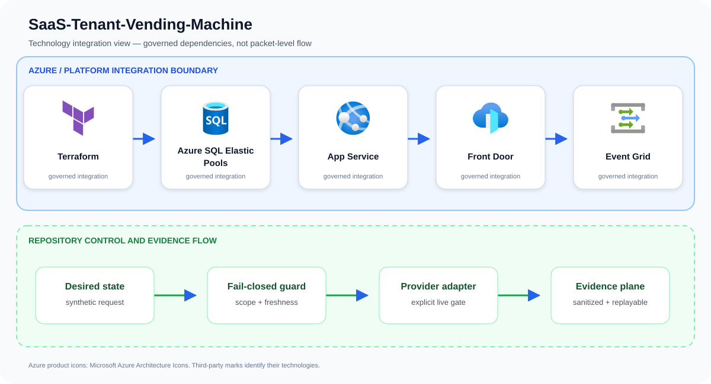

# SaaS-Tenant-Vending-Machine

Provision isolated SaaS tenant infrastructure from an authenticated business event with complete lifecycle tracking.

## Problem statement

A signed tenant-onboarding event becomes an idempotent plan for isolated database, application, hostname, routing, monitoring, and ownership resources after policy approval.

A production implementation can still fail even when every resource deploys successfully. The material risk is cross-tenant impact from rushed onboarding, shared capacity, routing, or identity decisions that are difficult to unwind. The design therefore treats Terraform, Azure SQL Elastic Pools, App Service, and the surrounding identity and evidence controls as one reviewable system rather than unrelated configuration tasks.

## Example case study

### Situation

A B2B SaaS vendor needs new customers online in minutes but manual provisioning causes configuration drift. The vending machine turns onboarding into a repeatable transaction with clear rollback and cost attribution.

### Response

Sales closes a customer needing routing, database placement, identity, and telemetry. The approved tenant record becomes a repeatable plan; missing ownership or unsafe networking is rejected with evidence for support and finance.

The team first exercises the repository's synthetic approved and denied fixtures. An approved request must produce the same idempotent plan on replay; a stale, unscoped, public, or unapproved request must fail before an Azure adapter is allowed to run.

### Expected outcome

Stakeholders receive a decision package they can attach to a change record: requested scope, controls evaluated, the reason for approval or denial, and the explicit handoff to live integration. The example supports design review and incident rehearsal without pretending that a local test changed Azure.

## Architecture

A signed signup event enters Event Grid and a durable orchestrator, which validates entitlement and invokes Terraform modules for database, app, routing, DNS, secrets, budgets, and tags. State and compensation steps are tenant-scoped.

Primary services: `Terraform`, `Azure SQL Elastic Pools`, `App Service`, `Front Door`, `Event Grid`.

This repository implements the first production-oriented vertical slice: a
fail-closed, adapter-neutral control plane that validates tenant scope,
freshness, approvals, secretless identity, private access, and the exact
project action before producing a deterministic execution plan. Azure adapters
consume that plan; they are deliberately outside the local simulator so local
tests cannot claim a live cloud change occurred.



The upper boundary names the principal services and technologies used by this repository. The lower boundary shows the implemented control flow: desired state is validated, provider action remains an explicit integration gate, and sanitized evidence is retained for review and deterministic replay.

Azure product icons come from [Microsoft's official Azure Architecture Icons](https://learn.microsoft.com/azure/architecture/icons/). Open-source marks are sourced from [Simple Icons](https://simpleicons.org/) when shown; each mark identifies its respective technology.

## Quickstart

Requirements: Python 3.11+ and Git. No Azure credentials are required.

```bash
./scripts/validate.sh
python3 src/control_plane.py --request examples/approved-request.json
```

The command emits canonical JSON with a stable idempotency key. The denied
fixture exits with status 2 and explains the failed invariants.

## Security boundaries

- Managed identity or workload identity only; embedded credentials are denied.
- Public network access and stale evidence are denied.
- Production and break-glass targets require explicit approval.
- The IaC entry point is opt-in and defaults to deploying nothing.
- Evidence output contains identifiers and decisions, never credential values.

## Verification and limitations

Local validation covers 13 tests, deterministic replay, JSON parsing, Python
compilation, ignore hygiene, and Bicep compilation when a compiler is present.
It does **not** prove Azure deployment, service licensing, quota, data-plane
permissions, provider/API availability, cloud failover, load, cost, or teardown.
See [`docs/test-matrix.md`](docs/test-matrix.md) and [`docs/runbook.md`](docs/runbook.md) before any integration trial.

## Community

See [`CONTRIBUTING.md`](CONTRIBUTING.md), [`SECURITY.md`](SECURITY.md), [`SUPPORT.md`](SUPPORT.md), and [`LICENSE`](LICENSE). The reference
is intentionally conservative and uses synthetic identifiers only.

## Repository guide

- [Architecture](docs/architecture.md)
- [Threat model](docs/threat-model.md)
- [Operations runbook](docs/runbook.md)
- [Test matrix](docs/test-matrix.md)
- [Cost model](docs/cost-model.md)
- [Security policy](SECURITY.md)
- [Contributing guide](CONTRIBUTING.md)
- [Support policy](SUPPORT.md)
- [Changelog](CHANGELOG.md)
- [License](LICENSE)
